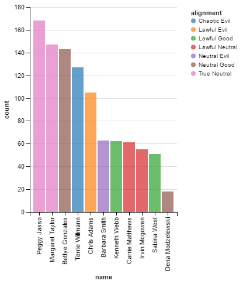

```python
from voters import Simulation
from altair import *
import pandas as pd
```


```python
sim = Simulation(n_people=1000, n_candidates=11)
```


```python
data = pd.DataFrame(sim.vote())
```


```python
Chart(data).mark_bar().encode(x=X('name', sort=SortField(field='count', order='descending', op='sum')), y='count', color='alignment')
```


<div class="vega-embed" id="9a106cb9-17e2-4fc7-bb1c-246f30b00dc1"></div>

<style>
.vega-embed svg, .vega-embed canvas {
  border: 1px dotted gray;
}

.vega-embed .vega-actions a {
  margin-right: 6px;
}
</style>





```python
pop_data = pd.DataFrame(sim.data)
Chart(pop_data).mark_point().encode(x='state', y='moral', color='alignment', shape='candidate')
```


<div class="vega-embed" id="3ae1194a-631a-4de0-a01b-c5e5a4d87e81"></div>

<style>
.vega-embed svg, .vega-embed canvas {
  border: 1px dotted gray;
}

.vega-embed .vega-actions a {
  margin-right: 6px;
}
</style>


